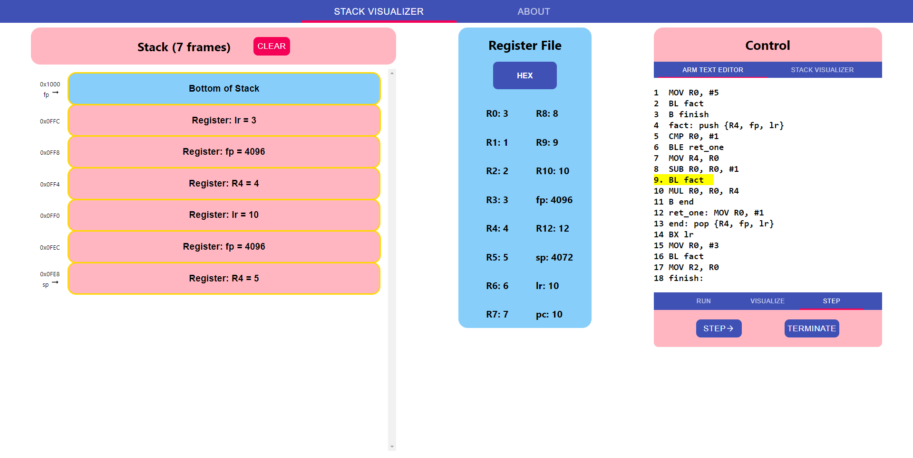

The stack visualizer is a tool to better understand how the stack works.  There are two functionalities: The ARM Text Editor accepts ARM code that can be executed with the visual of the stack updating in real time.  In the visualize tool, the user can push registers or functions onto the stack and pop them off.
